# M358K - Homework 1
posted on: September 12th, 2017
due: September 26th, 2017

# Questions

    Emails: which variables are useful to distinguish spam?
    In this homework, you will explore the dataset emails to help answering the question: which variables are useful to distinguish spam vs regular emails? The Emails dataset. data/emails.csv on Canvas. Variable description. data/emails-descrip.txt on Canvas.


## Spam vs Format: descriptive analysis with categorical variables

    *NOTES: To make it more clear, I rename the level in spam and format, where 0 and 1 become not_spam/plain_text and spam/formatted, the variables are also renamed.

### Produce a mosaic plot of spam vs format. What does this mosaic plot reveal?


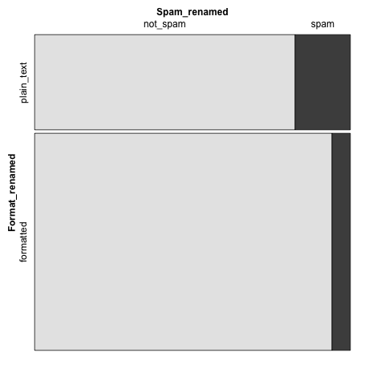
 
Mosaic graph here describe a relationship between the spam and format by category and reveal a comparison of the percentage of spam between in plain text and in formatted text. We can clearly see the percentage of spam in plain text is larger than that in formatted text(HTML). And the graph also shows that the percentage of formatted text is larger than that of plain text.


### Produce a table of spam vs format.

**Table Spam vs. Format**

Table1|plain_text|formatted
:--- | ---: | ---: 
not_spam | 986 | 2568
spam|209|158

By calculation:
- the percent of spam that are formatted is 57%. 
- The percent of non-spam that are formatted is 94.20%. 
- The percent of formatted emails that are spam is 5.8%. 
- The percent of plain text emails that are spam is 17.5%. 
- From calculation, we can know the exact percentage shown on the mosaic graph. 


```....```


### Summarize the relationship between spam and format in a couple of sentences.

	For emails have format, less chance for it to be a spam email, which is only 5.80% of spam emails. Then within the spam emails, there is more chance for a selected email to be in plain text. Therefore, if you know a email that is plain text form, then it is more possible for a selected email to be spam. If you know a email that is spam, there is more probability that a selected email would be plain text. Therefore, in general, plain text format would be related to spam more than related to non-spam.
	
```...```

## Sometimes it is useful to recode variables. spam vs exclaim mess is an example.

### Make a dotchart, a boxplot, a histogram and a violin plot of spam vs exclaim mess. 

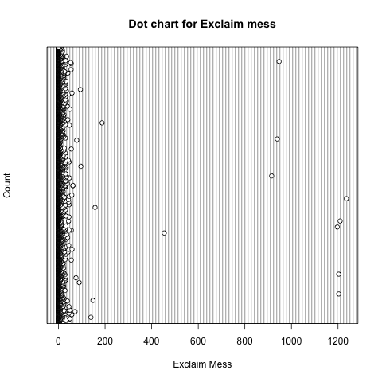

**Boxplot for spam vs Exclaim_mess**

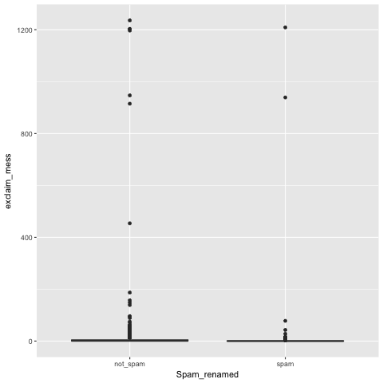
 
**Histogram for Exclaim mess**

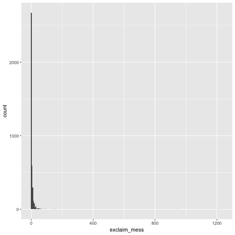

**Violin Plot for Spam vs. Exclaim mess**

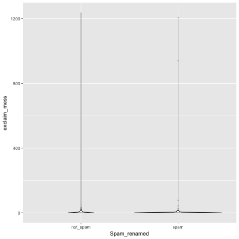

### Which of the above plots are useful for describing the distribution of this variable? 

What do those plots convey? Why are the other plots not as useful? 
Summarize the relationship between spam and exclaim mess in a couple of sentences. 
Dot chart and histogram are useful for describing the distribution of the variable Exclaim mess. The other two plots – box plot and violin plot are useful to describe the differences between spam and non-spam according to the count in exclaim mess with proportion. And histogram and dot chart could also have comparison as shown later in the next page.
Both dot chart and histogram convey the information that most emails have little exclaim mess. Histogram is more useful because you can tell there is a lot of zero exclaim mess but have no idea how many, whereas histogram can convey an approximate number of how many zero or one exclaim mess emails are. As for box and violin plot, spam and non-spam perform very similarly, that the shape on these two graphs seems to be the same if ignoring the size.  
The case for exclaim mess close to zero are too much and other part with larger exclaim mess are relatively too small. As a result both spam and non-spam emails have similar characters that most exclaim mess are what close to zero, and the only difference is that more non-spam emails are counted, which is simply because there is more non-spam emails totally.


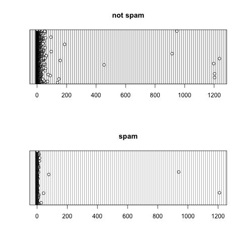

 
    Recode exclaim mess into 4 values: 0,1,2,>= 3. Call this new variable exclaim mess.recode. 

### What is the type of this new variable? 
The new variable become ‘factor.’


### Produce a table and a mosaic plot of spam vs exclaim mess.recode. What do they reveal?
**Table2  Spam vs Exclaim mess.recode**

Table2|	[0,1) |	[1,2) |	[2,3) |	[3,Inf)
---|---|---|---|---
not_spam |	1219 |	650 |	482 |	1203
spam |	216 |	83	| 25 |	43

**Mosaic Spam vs Exclaim mess.recode**


From above table, I can see the number of non-spam emails in [0,1] and [3, inf] level of exclaim mess for spam are close both a little bit more than 1200 but the number of spam emails in such two categories have large difference that [3, Inf ) that [3, Inf ) have much less spam emails. The number also decrease a lot for [1,2] and [2, 3] in terms of both spam and non-spam emails, but not as much as spam in [3, Inf ). 
From the mosaic graph, we can see same trend in terms of proportion for each categories of exclaim mess.recode. The percentage of spam emails decrease as the range of category move to larger numbers. 


### Summarize the relationship between spam and exclaim mess.recode in a couple of sentences. 

Therefore, in this sample, we know zero exclaim mess have a highest probability to have a selected email to be spam, and the probability that a selected email to be spam in the shown range of exclaim mess decrease as the number of exclaim mess increase.


### Why is it reasonable to recode exclaim mess? 

Because there are not much larger exclaim mess, accumulate the large exclaim mess together in one category will make every feature more clear. Otherwise we can only see a spike around zero and flat elsewhere but having no idea how it actually perform.

 
### Bonus question | How would your summary on the relation between spam and exclaim mess change if you had recoded it into x values?

    5 values? 10 values? 3 values? Which regroup is most reasonable, and why?
	
For 5 values, a mosaic graph will looks like:

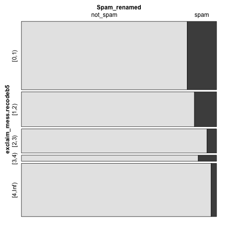

For 10 values, a mosaic graph will looks like:

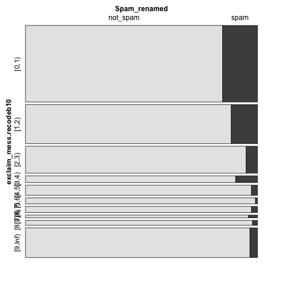

For 3 values, a mosaic graph will looks like:

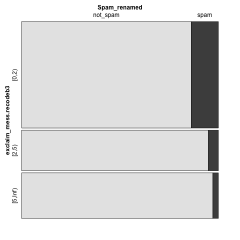

By regroup the exclaim_mess, I found the probability of a select email from certain range does not simply decrease as the range increase along the ordered category. The probability for ranges start with larger exclaim mess will certainly have smaller probability than zero or one exclaim mess, but not totally stable after two or three, which can be proved easily by mosaic graph when dviding exclaim_mess into ten groups.

I prefer five groups because it have a little more details than three groups and four groups, but each categories will not be too thin that even the name of a category can not suit it it like the ten group exclaim_mess graph. More details are important because if there is only three groups, you loss too much information while transferring a numerical type of data to factor. Therefore, it is easier to manipulate the data and group them into the way that probably will support your answer. Our aim of group is to accumulate the extra outliers to on big group with representative of the character of large exclaim mess – less probability of selecting a email to be spam. Thus, I prefer to group into 5 values.
 

## Spam vs num char: descriptive analysis with numerical variables


### Make a dotchart, boxplot and violin plot of spam vs num char. 

**COMPARISON BETWEEN SPAM AND NON-SPAM**

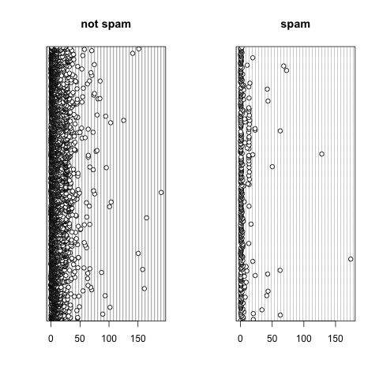

**Box Plot for Spam vs. Num Char**

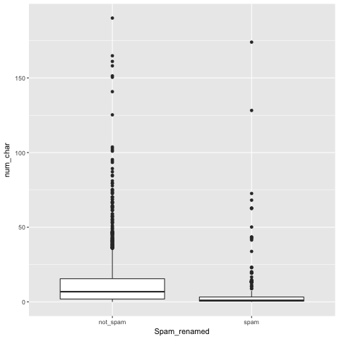

**Violin Plot for Spam vs. Num Char**

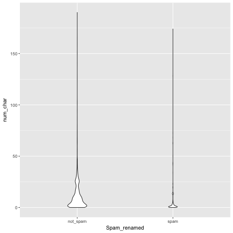
 


 
 
 

### Which of the above plots are useful for describing the distribution of this variable? 


What do those plots convey? Summarize the distribution of num char in a couple of sentences.

Violin plot is useful for describing the distribution of num_char while comparing spam and non-spam emails. Since Box plot only tell minimum, first quartile, median, third quartile, and maximum, we cannot gain an overview of the distribution. And dot plot can show that there is a lot of data points but not clear on how much more around zero than elsewhere. 

As for violin plot in this case, the position on non-spam is larger and includes a larger range between zero and fifty with a strike around 25, whereas the spam distribution of num_char focus on zero with a small strike at around 10 to 15. 

Then we can address with more confidence that spam email are more likely to spread close to zero with a small strike around 15 num_char. As for email num_char in other ranges, the probability of a selected email to be non-spam is higher.
